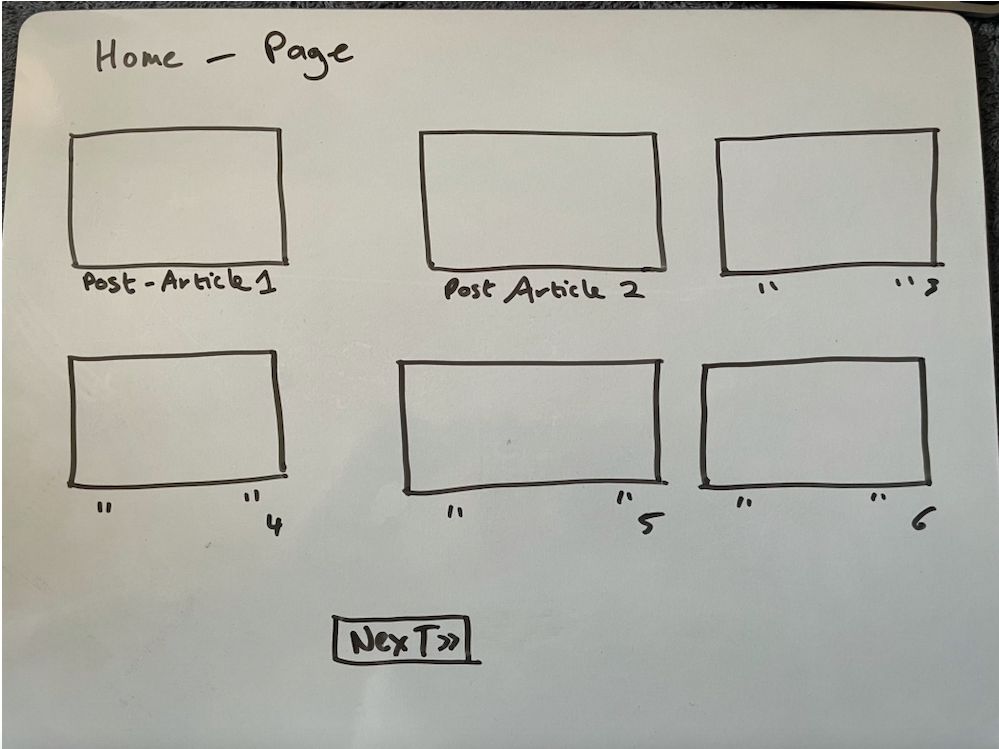
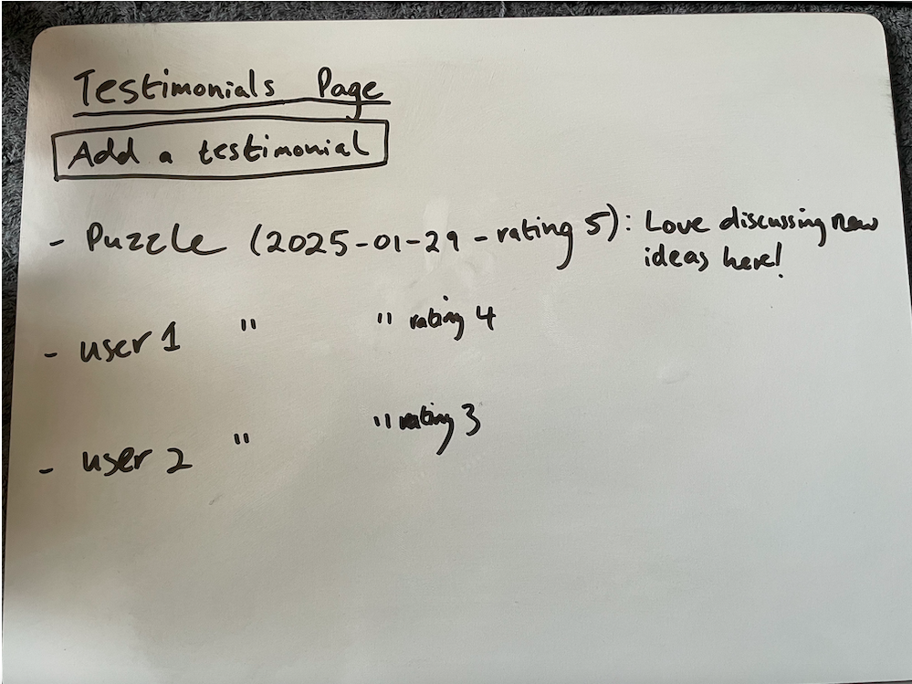
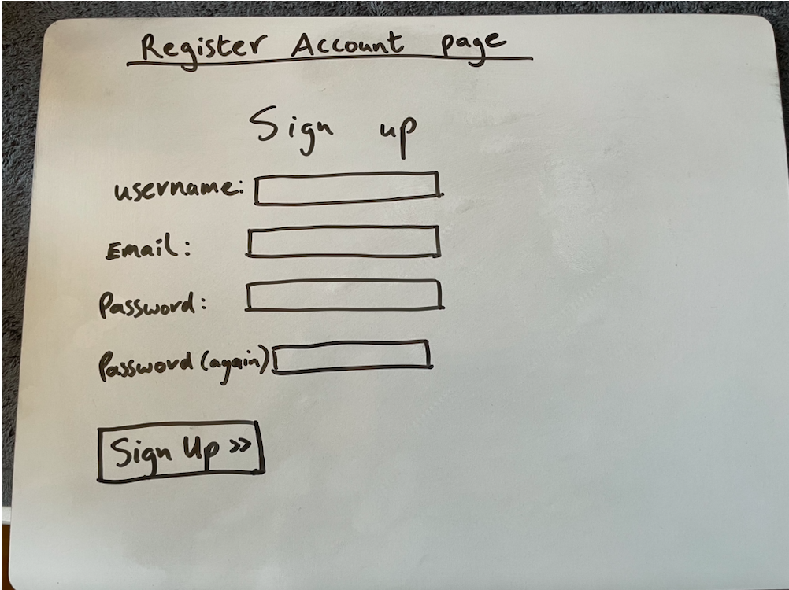
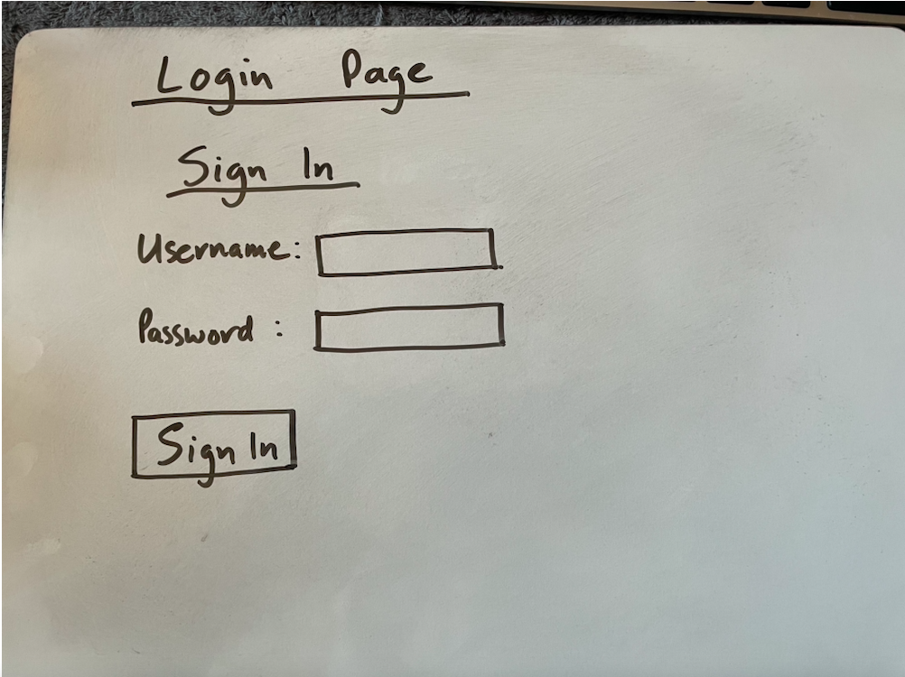

# Reddit-Like Website

A community-driven, news and discussion website, where users can create posts, comment on articles, and engage in meaningful discussions. This project was built as part of the Full-Stack Toolkit Portfolio requirement, showcasing Django as the main framework with additional libraries and services.

---

## Table of Contents
1. [Project Overview](#project-overview)
2. [Live Demo / Deployment](#live-demo--deployment)
3. [Design](#design)
   - [Wireframes and Mockups](#wireframes-and-mockups)
   - [Design Rationale](#design-rationale)
4. [User Experience (UX)](#user-experience-ux)
   - [User Stories](#user-stories)
   - [Site Goals](#site-goals)
5. [Features](#features)
   - [Existing Features](#existing-features)
   - [Future Features](#future-features)
6. [Data Model](#data-model)
7. [Technologies Used](#technologies-used)
8. [Testing](#testing)
9. [Deployment](#deployment)
10. [Credits](#credits)
11. [Bug](#bug)

---

## Project Overview

This project aims to create a Reddit-like news and discussion platform, allowing users to:

- Read and post articles or discussion topics.
- Comment on existing posts.
- Manage their own content through editing or deleting comments.

Developed throughout the **Code Institute** Full-Stack Toolkit learning path, this project demonstrates the use of Django’s MTV (Model-Template-View) pattern, user authentication, and CRUD functionality on both the front and back end.

**GitHub Repository:**  
[Reddit-Like Website GitHub Repo](https://github.com/Niall-5P/Reddit-Like-Website.git)

---

## Live Demo / Deployment

- [https://git.heroku.com/reddit-like-site.git](#) 

---

## Design

### Wireframes and Mockups
Below are the wireframes created to plan the layout and user flow of the site.

1. **Home Page**
   

2. **Testimonial Page**
   

3. **Register account page**
   

4. **Login page**
   

### Design Rationale
To capture the familiar feel of a Reddit-style platform, a predominantly white background is used throughout the site. This choice helps ensure that text-based content, such as post titles and comments, remains the main focal point. A white background also mirrors Reddit’s clean, minimalist appearance, offering a sense of familiarity for users who may have experience with the original platform. Additional accent colors can be placed strategically for navigation elements or buttons, helping them stand out against the background while maintaining an overall clean and modern aesthetic.

## User Experience (UX)

### User Stories

1. **As a Site User**, I want to sign up and log in so that I can create my own posts and interact with content.  
2. **As a Site User**, I want to be able to comment on posts so that I can engage with other users.  
3. **As a Site User**, I want to edit or delete my own comments so I can correct mistakes or remove content.  
4. **As a Site Admin**, I want to moderate posts and comments via the admin panel for inappropriate content.  

### Site Goals

- Provide a clean, responsive interface for reading, creating, and commenting on user-generated content.
- Make site moderation simple for administrators, ensuring a positive community environment.

---

## Features

### Existing Features

1. **Home Page & Blog Posts**  
   - Displays a list of published posts with pagination.  
   - Shows post titles, excerpts, authors, and timestamps.

2. **Post Detail Page**  
   - Displays the full post content.  
   - Shows approved comments and a form for authenticated users to add new comments.

3. **User Authentication**  
   - Utilizes Django’s `allauth` for account registration, login, and logout.  
   - Logged-in users can create posts, comment, and edit/delete their comments.

4. **Comment Moderation**  
   - Site Admin can approve or reject comments in the admin panel.  
   - Users see only approved comments.

5. **Custom Testimonials**  
   - Users can submit testimonials (a custom model) to share site feedback.  
   - Admin reviews and approves testimonials for public display.

6. **Responsive Layout**  
   - Built with Bootstrap 5, ensuring a mobile-friendly layout.

### Future Features

- **Search & Filter**: To quickly find posts by keywords or categories.  
- **User Profiles**: Show user statistics, such as number of posts or comments.  
- **Categories/Tags**: Organize posts into topics for easier navigation.

---

## Data Model

Below is an overview of key models in the project:

1. **Post**  
   - `title` (CharField, unique)  
   - `slug` (SlugField, unique)  
   - `author` (ForeignKey → User)  
   - `featured_image` (CloudinaryField / placeholder)  
   - `content` (TextField)  
   - `excerpt` (TextField, optional)  
   - `status` (IntegerField: Draft/Published)  
   - `created_on` (DateTimeField)  
   - `updated_on` (DateTimeField)

2. **Comment**  
   - `post` (ForeignKey → Post)  
   - `author` (ForeignKey → User)  
   - `body` (TextField)  
   - `approved` (BooleanField)  
   - `created_on` (DateTimeField)

3. **Testimonial** *(Original Custom Model)*  
   - `author` (ForeignKey → User, nullable)  
   - `content` (TextField)  
   - `rating` (IntegerField, optional)  
   - `approved` (BooleanField)  
   - `created_on` (DateTimeField)

---

## Technologies Used

1. **Front-End**  
   - [HTML5](https://developer.mozilla.org/en-US/docs/Web/HTML)  
   - [CSS3](https://developer.mozilla.org/en-US/docs/Web/CSS)  
   - [Bootstrap 5](https://getbootstrap.com/)

2. **Back-End**  
   - [Python 3](https://www.python.org/)  
   - [Django 4+/5+](https://www.djangoproject.com/)  
   - [PostgreSQL](https://www.postgresql.org/) (Production DB)  
   - [Cloudinary](https://cloudinary.com/) (For image hosting)

3. **Authentication**  
   - [Django Allauth](https://django-allauth.readthedocs.io/) for user registration/login.

4. **Deployment Tools**  
   - Hosting platform (e.g., Heroku)  
   - [Gunicorn](https://gunicorn.org/) for production server.  
   - [Whitenoise](https://pypi.org/project/whitenoise/) for static files.

5. **Version Control**  
   - [Git](https://git-scm.com/) & [GitHub](https://github.com/) for source control.

## Testing

| **Test Scenario**        | **Steps**                                                                                                                                               | **Expected Result**                                                                                   | **Actual Result**                                                      | **Pass/Fail** |
|--------------------------|----------------------------------------------------------------------------------------------------------------------------------------------------------|-------------------------------------------------------------------------------------------------------|------------------------------------------------------------------------|--------------|
| **Register & Login**     | 1. Go to `/register` → enter valid details → submit. 2. Navigate to `/login` → enter correct username/password → submit.                             | User can register, then log in with valid credentials.                                                | Form submission succeeded; user authenticated as expected.             | Pass         |
| **Create Post (Django)** | 1. While logged in, visit `/add-post`. 2. Enter a title and content → submit.                                                                     | Post is saved to the database; appears on the homepage or post detail page.                            | Successfully created a new post; verified in DB and on the homepage.   | Pass         |
| **Add Comment (Django)** | 1. Open a post detail page. 2. Enter a comment in the text area → submit.                                                                             | Comment is saved to the database; displayed if auto-approved or after admin approval.                  | Comment stored properly; appears under the post.                       | Pass         |
| **Add Testimonial**      | 1. While logged in, visit `/add-testimonial`. 2. Enter testimonial content (and optional rating) → submit.                                        | Testimonial is saved to the database; success message shown; may remain pending for admin approval.    | Testimonial created as expected; appears in admin for approval.        | Pass         |
| **Responsive Layout**    | 1. Resize browser (mobile, tablet, desktop). 2. Check that navigation, text, and images adjust properly at different viewports.                       | The site remains legible; navbar and content adapt fluidly to screen size.                             | Layout remains consistent; no overlapping or cutoff elements.          | Pass         |
| **Error Handling**       | 1. Submit form(s) with empty or invalid fields (e.g., no `content`). 2. Attempt to access protected pages (e.g., add testimonial) when logged out.     | Relevant error messages appear; restricted pages redirect to login if user is not authenticated.       | Forms display validation errors as expected; unauthorized users redirected. | Pass         |

**Testimonial View Tests Overview**

- **Anonymous User**  
  Verifies that a user who is not logged in cannot access the testimonial creation page. The test expects either a redirect to the login page (`302` status) or a `403 Forbidden` response.

- **Logged-In User**  
  Confirms that a signed-in user can successfully post a new testimonial. After submitting valid data, the response should be a redirect (`302`) back to the testimonial list page, along with a success message indicating that the testimonial was created.

By testing these scenarios, we ensure that:
1. **Access Control**: Only authenticated users can create testimonials.
2. **Form Submission**: Testimonial data is correctly handled and saved to the database, and the user is appropriately redirected afterward.

### JavaScript Client-Side Testing

A simple **QUnit** test was implemented to validate a rating input on the client side. The test checks:

1. **Valid Rating**  
   Ensures that calling `validateRating(3)` returns `true`, confirming that 3 is accepted as a valid rating.

2. **Rating Below 1**  
   Calls `validateRating(0)` and expects `false`, ensuring ratings lower than 1 are rejected.

3. **Rating Above 5**  
   Calls `validateRating(6)` and expects `false`, verifying ratings higher than 5 are rejected.

All tests passed, confirming the function correctly enforces the **1–5 rating** constraint on the client side. The test file is accessed by simply opening the `.html` test file in a browser, which runs QUnit and displays the results.

   **Manual Testing**
   - Responsiveness: Verified using Chrome DevTools for various screen sizes.
   - User Flows: Registered a new user, created test posts, left comments, edited, and deleted them.
   - Error Handling: Checked 404 pages, form validation, protected routes (only logged-in users can 
     submit posts/comments).

   **Code Validation**
   - HTML/CSS: Validated with W3C validators.
   - Python (PEP8): Utilized Flake8 or a similar linter for style checks

## Credits
   - Code Institute walkthroughs and documentation for foundational guidance.
   - Django Documentation for best practices on models, views, and deployment.
   - Bootstrap for quick, responsive UI development.
   - Cloudinary for image management.
   - YouTube channel Desphixs - https://www.youtube.com/watch?v=TIDldj2BDuY
   - ChatGpt
   **Acknowledgement**
   - Mentors & Peers for reviews and advice
   - Friends & Family for UI/UX testing and feedback
   - Student Support code institute.

## Bug
   - When attempting to delete a testimonial, a NameError is raised because message is undefined in testimonials/views.py. This issue occurs due to the incorrect use of message.success instead of messages.success in the testimonial_delete view.

   **Unresolved bug**
   - Some articles from 'I think therefore I blog' appeared on my site when I ran some migrations I believe. I just had to delete them.